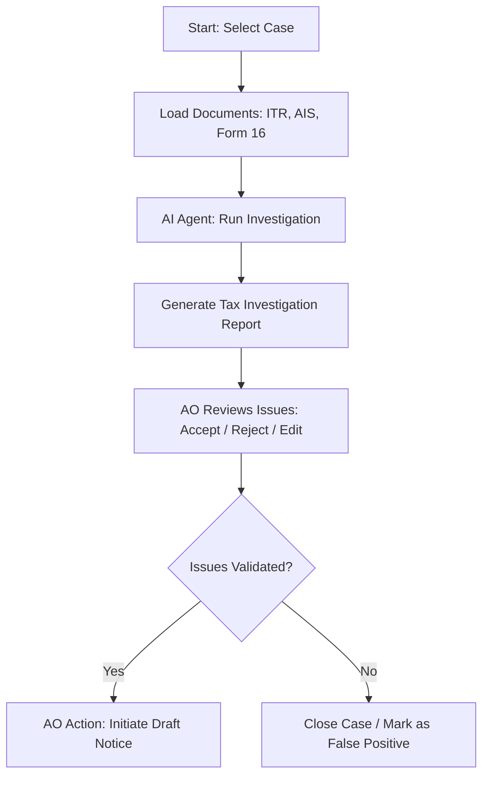
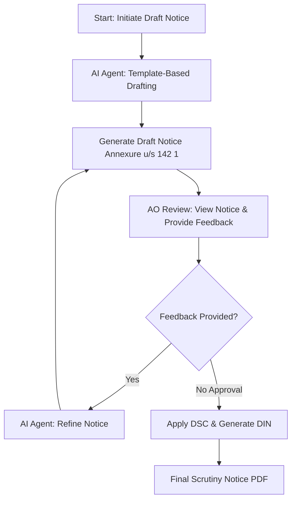

# Problem Statement: AI-Assisted Tax Investigation & Notice Drafting Portal

## 1. Background & Context

In the Indian Income Tax Department, Assessing Officers (AOs) review thousands of taxpayer records annually to identify tax evasion, income concealment, and filing discrepancies. This process involves manually cross-referencing multiple complex documents:
*   **ITR Extract**: The Income Tax Return filed by the taxpayer.
*   **Form 16**: The TDS (Tax Deducted at Source) certificate issued by the employer.
*   **AIS (Annual Information Statement)**: A comprehensive summary of all financial transactions of a taxpayer (e.g., share transactions, mutual funds, interest income, high-value bank deposits).
*   **TIS (Taxpayer Information Summary)**: A consolidated summary of the information collected in the AIS.

### The Problem
Manually identifying mismatches between these documents (e.g., salary reported in ITR vs. Form 16, undisclosed property transactions in AIS, unexplained cash deposits) is labor-intensive, error-prone, and slow. Furthermore, drafting legally compliant scrutiny notices (such as under Section 142(1) or Section 148 of the Income Tax Act, 1961) requires mapping each identified issue to specific statutory provisions, collecting appropriate supporting evidence requests, and formatting the output to conform to standard templates.

### The Solution
We want to build a **Human-in-the-Loop (HITL) AI-Assisted Portal** that:
1.  **Automates Forensic Investigation**: Uses LLMs and structured workflows (via LangGraph) to analyze ITR, AIS, and Form 16, identifying the top critical discrepancies.
2.  **Facilitates AO Review**: Provides an interactive dashboard where the Assessing Officer can inspect, edit, accept, or reject the AI-flagged issues.
3.  **Generates and Refines Notices**: Employs template-based drafting agents to produce high-quality scrutiny notices and iteratively refines them based on the AO's custom feedback.
4.  **Generates Final Output**: Simulates DIN (Document Identification Number) generation, applies digital signatures (DSC), and outputs a ready-to-serve notice.

---

## 2. Product Workflow (Phases)

Your team will build an application implementing the following two phases:

### Phase 1: Investigation Phase

1.  **Case Assignment**: The AO selects a taxpayer case from a dashboard (e.g., cases flagged due to high-value transactions like bank deposits exceeding ₹10 lakhs).
2.  **Document Analysis**: The backend processes the taxpayer's digital records (ITR, AIS, Form 16).
3.  **Discrepancy Spotting**: The AI Agent identifies key anomalies such as:
    *   Salary mismatch (ITR vs. Form 16).
    *   Unreported high-value transactions (AIS shows property sale or bank deposits, but ITR does not reflect them).
    *   Under-reporting of income from other sources (interest, dividends).
4.  **Tax Investigation Report**: The AI returns a structured markdown report displaying taxpayer details and an interactive list/table of critical issues.
5.  **AO Decision**: The AO reviews each discrepancy, checking boxes to accept/reject issues or edit their details.

---

### Phase 2: Notice Drafting & Refinement Phase

1.  **Notice Generation**: The drafting agent takes the approved discrepancies and maps them onto the standard **Section 142(1)** scrutiny notice template, structuring specific evidence requests for each discrepancy.
2.  **AO Review & Feedback**: The AO reviews the draft notice side-by-side with the case details. If changes are needed, the AO writes feedback (e.g., *"Remove issue #2, add a clause asking for capital gains bank account statements for issue #1"*).
3.  **AI Refinement**: The refining agent parses the feedback, applies the changes, re-orders paragraphs, updates the summary, and generates a refined draft.
4.  **Sign-off & DSC**: Once satisfied, the AO approves the draft. The system assigns a dummy DIN and signs it, producing the final PDF/document.

---
